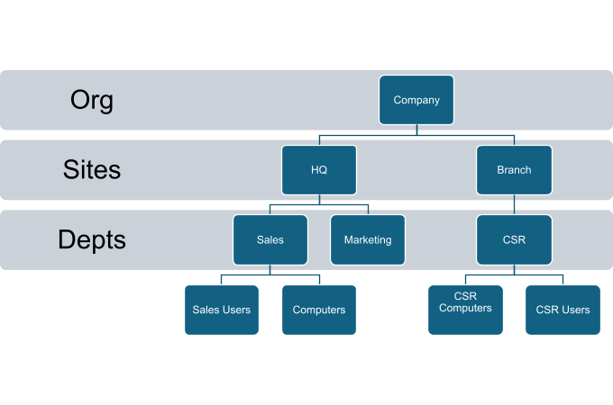

# 🏗️ Hybrid Active Directory & Azure Infrastructure Lab


A hands-on enterprise infrastructure lab that walks through the full lifecycle of setting up, securing, automating, and extending an on-premises Active Directory environment into Microsoft Azure. Every task was completed in a real environment — not just theory.

---

## 📌 Why This Project?

Most IT certifications teach you *what* things are. This lab was about figuring out *how* they actually work together. I built this to deeply understand how enterprise environments are structured — the kind of environment you walk into on day one at a mid-to-large company — and how to manage it efficiently.

---

## 🗺️ Architecture Overview

The lab is built around a hub-and-spoke hybrid model. On-premises AD DS is the identity source, synced to Microsoft Entra ID via Entra Connect. Azure hosts a domain controller replica and connected workloads through a Site-to-Site VPN.

```


┌─────────────────────────────────────────────────────────────────┐
│                        ON-PREMISES ENVIRONMENT                  │
│                                                                  │
│   ┌──────────────────────────────────────────────────────────┐  │
│   │                   Active Directory DS                     │  │
│   │                                                           │  │
│   │   ┌─────────────┐    ┌─────────────┐   ┌─────────────┐  │  │
│   │   │  HQ Toronto │    │  Sales OU   │   │   HR OU     │  │  │
│   │   │  OU (Root)  │───▶│  Users      │   │  Users      │  │  │
│   │   │             │    │  Computers  │   │  Computers  │  │  │
│   │   └─────────────┘    └─────────────┘   └─────────────┘  │  │
│   │                                                           │  │
│   │   AGDLP Model:  Users → Global Groups → DL Groups → Perms│  │
│   └──────────────────────────────────────────────────────────┘  │
│                              │                                    │
│                     Entra Connect Sync                            │
│                              │                                    │
└──────────────────────────────┼──────────────────────────────────┘
                               │  Site-to-Site VPN
                               ▼
┌─────────────────────────────────────────────────────────────────┐
│                        MICROSOFT AZURE                           │
│                                                                  │
│   ┌──────────────────┐       ┌──────────────────────────────┐   │
│   │  Microsoft        │       │  Hub VNet                    │   │
│   │  Entra ID         │       │  ┌──────────┐  ┌──────────┐  │   │
│   │                   │       │  │  Azure   │  │  Azure   │  │   │
│   │  - SSPR           │       │  │  DC VM   │  │ Firewall │  │   │
│   │  - PTA            │       │  └──────────┘  └──────────┘  │   │
│   │  - PW Writeback   │       │                               │   │
│   │  - PW Protection  │       │  Spoke VNets (peered)         │   │
│   └──────────────────┘       └──────────────────────────────┘   │
│                                                                  │
│   ARM Templates / PowerShell ──▶ Repeatable Infra Deployments   │
└─────────────────────────────────────────────────────────────────┘
```

---

## 🔑 Key Features

- **OU Design** — Flat, policy-focused hierarchy separated by function (Users / Computers), not geography
- **AGDLP Permissions** — Role-based access using Account → Global Group → Domain Local Group → Permission nesting
- **PowerShell Automation** — CSV-driven bulk user creation, group assignment, OU and security group provisioning
- **Group Policy** — Drive mapping, password policy baseline, Chrome enterprise deployment, GPO hygiene
- **Microsoft Entra Connect** — Hybrid identity sync with delta sync, attribute verification, SSPR, PTA, and password writeback
- **Azure Infrastructure** — VM provisioning, resource groups, hub-and-spoke VNet design, Site-to-Site VPN
- **Windows Admin Center** — Remote server management and Azure hybrid connectivity
- **Containers** — Docker installation and configuration on Windows Server
- **ARM Templates** — Infrastructure as Code for repeatable Azure deployments

---

## 🧰 Tech Stack

| Category | Tools / Technologies |
|---|---|
| Identity & Access | Active Directory DS, Microsoft Entra ID, AGDLP |
| Automation | PowerShell, CSV-based scripting |
| Policy Management | Group Policy (GPMC), GPO Baselines |
| Hybrid Identity | Microsoft Entra Connect, PTA, SSPR, Password Writeback |
| Cloud Infrastructure | Azure VMs, VNets, Azure Firewall, ARM Templates |
| Server Admin | Windows Server 2022, Windows Admin Center |
| Containers | Docker on Windows Server |
| Security | Password Protection, Account Lockout, Entra Conditional Access |

---

## 📁 Repository Structure

```
Hybrid-AD-Azure-Lab/
├── README.md                  # This file
├── docs/
│   └── IMPLEMENTATION.md      # Full step-by-step build notes
├── scripts/
│   ├── README.md              # Scripts overview
│   ├── bulk-user-creation.ps1 # CSV-based user onboarding
│   ├── dept-ou-groups.ps1     # Auto OU + security group creation
│   ├── password-policy.ps1    # Domain password policy config
│   └── arm-deploy.ps1         # Azure resource deployment
├── templates/
│   ├── README.md              # ARM templates overview
│   └── hub-vnet.json          # Hub VNet ARM template
└── images/
    └── (all screenshots)
```

---

## ⚙️ Core Implementations

### 1. OU Design

The OU structure mirrors operational and administrative needs rather than physical locations. Each department has a parent OU with separate `Users` and `Computers` sub-OUs under an `HQ Toronto` root.




**Best practices followed:**
- Flat hierarchy — max 2–3 levels deep
- Policy-driven design — each OU exists because it needs a different GPO or delegation scope
- Naming conventions — consistent, human-readable names across all OUs and groups
- ProtectedFromAccidentalDeletion enabled on all OUs

---

### 2. AGDLP Access Model

```
User Account (rgoyal)
      │
      ▼
Global Group: Sales Team
      │
      ▼
Domain Local Group: SalesReadOnly
      │
      ▼
Permission: Read access on \\server\SalesFiles
```

This pattern keeps permissions clean, auditable, and easy to change. Swapping access for an entire team means updating one group — not touching individual user accounts.

---

### 3. PowerShell Onboarding Automation

Users are created from a CSV file. The script handles account creation, group membership, password setup, and forced change at first login.


### Department OU and Group Provisioning

A single script iterates every department OU under HQ Toronto and automatically creates Users/Computers sub-OUs and five security groups per department.


See [`scripts/bulk-user-creation.ps1`](./scripts/bulk-user-creation.ps1) and [`scripts/dept-ou-groups.ps1`](./scripts/dept-ou-groups.ps1)

---

### 4. Group Policy Deployments

| GPO Name | Scope | Purpose |
|---|---|---|
| Domain-Baseline | Domain root | Password policy, lockout, auditing |
| SalesDriveMap | Sales OU | Auto-map S: drive to \\server\Sales |
| ChromeInstallation | Company OU | Deploy Chrome MSI via software installation |
| ChromeHomeBrowser | Company OU | Set default homepage via ADMX template |

### Password Policy


### Chrome Deployment


---

### 5. Microsoft Entra Connect & Hybrid Identity

Entra Connect was installed on the domain controller to sync on-premises identities to Microsoft Entra ID.


### Sync Verification

On-premises user changes and new account creations were verified in Microsoft Entra ID after a delta sync cycle.


### Password Writeback and PTA


Features configured:
- **Delta Sync** — incremental syncs triggered via `Start-ADSyncSyncCycle -PolicyType Delta`
- **Password Writeback** — cloud password resets flow back to on-prem AD
- **Pass-Through Authentication (PTA)** — users authenticate against on-prem AD, no password hash stored in Azure
- **Self-Service Password Reset (SSPR)** — users can reset passwords without IT involvement
- **Password Protection** — custom banned password lists enforced at the DC level

---

### 6. Azure Infrastructure

Provisioned via both Azure Portal and PowerShell/ARM templates:

- Resource group: `AZ-800`
- Windows Server 2022 VM: `myVM` in East US
- Hub VNet with domain controller, Azure Firewall, and route tables
- Spoke VNets peered to hub for workload isolation
- Site-to-Site VPN connecting on-premises pfSense to Azure VNet

---

## 💡 What I Learned

This project pushed me to go beyond just following documentation. Here are the real takeaways:

- **OU design is a policy problem, not an org chart problem.** The moment I stopped thinking about hierarchy and started thinking about "what GPO does this object need" — the design became much cleaner.
- **AGDLP feels bureaucratic until you have to audit access.** Then it's the only sane way to manage permissions at scale.
- **PowerShell is the difference between doing a task once and doing it 500 times.** Writing the onboarding script forced me to think about edge cases rather than just happy-path steps.
- **Hybrid identity is where things get real.** Getting Entra Connect working, verifying sync, and enabling writeback taught me more about how modern identity actually works than any study material.
- **Azure is just infrastructure — it needs the same discipline as on-prem.** Naming conventions, resource groups, and ARM templates are just as important in the cloud.

---

## 🔭 Future Improvements

- [ ] Add Terraform/Bicep versions of the ARM templates
- [ ] Build a full network diagram using draw.io or Lucidchart
- [ ] Add monitoring with Azure Monitor and Log Analytics
- [ ] Implement Conditional Access policies in Entra ID
- [ ] Add automated testing for PowerShell scripts using Pester
- [ ] Document the full pfSense VPN configuration

---

## 📖 Detailed Documentation

For the full step-by-step build process, scripts, troubleshooting notes, and Azure networking details, see [docs/IMPLEMENTATION.md](./docs/IMPLEMENTATION.md).

---

## 📄 License

This project is licensed under the MIT License. See [LICENSE](./LICENSE) for details.

---

## 👤 About Me

I'm an IT infrastructure enthusiast based in Mohali, India. I built this lab to develop real, hands-on skills in hybrid enterprise environments — the kind that matter in actual IT roles.

- 🐙 GitHub: [utkarshstudent75-gif](https://github.com/utkarshstudent75-gif)
- 📧 Email: utkarshstudent75@gmail.com

> *"The best way to learn infrastructure is to break it, fix it, and document what you did."*
