# Implementation Guide — Hybrid AD & Azure Lab

> This document is the complete step-by-step implementation guide for the Hybrid Active Directory + Azure lab environment. Every screenshot referenced below maps directly to an image in the [`/images`](../images/) folder.

---

## Table of Contents

1. [OU Design Best Practices](#1-ou-design-best-practices)
2. [AGDLP Model & Security Groups](#2-agdlp-model--security-groups)
3. [PowerShell User Onboarding](#3-powershell-user-onboarding)
4. [Shared Drive Mapping via GPO](#4-shared-drive-mapping-via-gpo)
5. [GPO Baseline & Policy Hygiene](#5-gpo-baseline--policy-hygiene)
6. [Password Policy](#6-password-policy)
7. [Automated Security Group Creation](#7-automated-security-group-creation)
8. [Google Chrome Deployment via GPO](#8-google-chrome-deployment-via-gpo)
9. [Microsoft Entra Connect — Download, Install & Configure](#9-microsoft-entra-connect--download-install--configure)
10. [Verifying AD DS ↔ Entra ID Synchronisation](#10-verifying-ad-ds--entra-id-synchronisation)
11. [Entra ID Integration Features in AD DS](#11-entra-id-integration-features-in-ad-ds)
12. [Windows Admin Center — Install & Configure](#12-windows-admin-center--install--configure)
13. [WAC in Hybrid Scenarios (Azure Network Adapter)](#13-wac-in-hybrid-scenarios-azure-network-adapter)
14. [Azure VM Deployment](#14-azure-vm-deployment)
15. [Installing and Configuring Containers](#15-installing-and-configuring-containers)
16. [ARM Templates](#16-arm-templates)
17. [Connecting On-Prem DC to Azure (Site-to-Site VPN)](#17-connecting-on-prem-dc-to-azure-site-to-site-vpn)
18. [Domain Joining Azure VM to On-Prem DC](#18-domain-joining-azure-vm-to-on-prem-dc)
19. [Hub and Spoke Topology in Azure](#19-hub-and-spoke-topology-in-azure)
20. [Firewall Deployment](#20-firewall-deployment)
21. [Spoke VM Deployment](#21-spoke-vm-deployment)
22. [VNet Peering between DC VNet and Firewall VNet](#22-vnet-peering-between-dc-vnet-and-firewall-vnet)
23. [Troubleshooting](#23-troubleshooting)

---

## 1. OU Design Best Practices

Organizational Units (OUs) are a fundamental component of Active Directory structure. A well-designed OU structure simplifies administration, enhances security, and streamlines Group Policy application.

### Key Design Tips

- **Mirror business structure** — Design your OU layout around administrative and operational requirements, not geography alone.
- **Delegate at the right level** — Assign permissions to specific OUs so local admins manage objects without impacting the entire domain.
- **Keep it flat** — Deep nesting slows Group Policy processing and complicates troubleshooting. Aim for no more than 3–4 levels.
- **Separate users and computers** — Maintain distinct OUs for user accounts and computer accounts to apply different GPOs.
- **Design for GPO** — OUs are the only containers where GPOs can be directly linked. Group objects that require similar policies.
- **Don't replace security groups** — OUs serve administrative/policy purposes; security groups control resource permissions.
- **Plan for growth** — Design flexibly to accommodate mergers, expansions, or restructuring.
- **Document everything** — Record the purpose of each OU, delegated permissions, and applied policies.
- **Avoid OU sprawl** — Only create OUs when necessary.
- **Use consistent naming** — Adopt clear naming conventions for easy navigation.

### Lab Environment OU Structure

Below is the OU structure implemented in the `itnethub.com` domain:

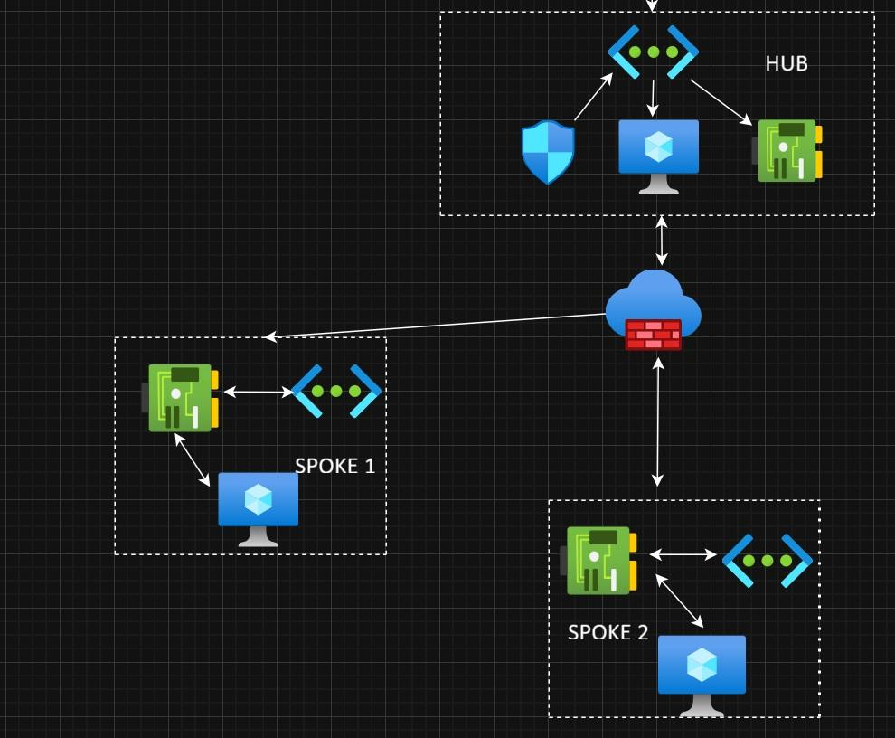

> The structure follows: `Company > HQ Toronto > [Departments] > Users / Computers`

---

## 2. AGDLP Model & Security Groups

**AGDLP** = **A**ccounts → **G**lobal groups → **D**omain **L**ocal groups → **P**ermissions (resource access)

```
Users  →  Global Groups  →  Domain Local Groups  →  Resource (permission)
```

### Example — Sales Department

- Sales team members are added to the **Sales team** global security group.
- The **Sales team** global group is made a member of the **Sales_Read_Only** domain local group.
- The `Sales Files` shared folder grants access to the **Sales_Read_Only** domain local group.

This model ensures clean permission delegation across domain boundaries.

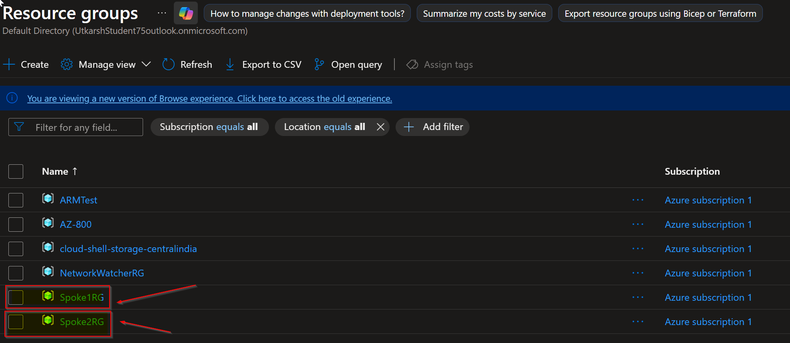

---

## 3. PowerShell User Onboarding

PowerShell automation ensures users are placed in the correct OUs, assigned to appropriate global groups, and granted permissions consistently — eliminating manual errors.

### Create 5 Sales Users Script

The script below creates 5 users in `OU=Sales Users,OU=Sales,OU=HQ Toronto,OU=Company,DC=itnethub,DC=com`, adds them to the **Sales team** security group, and forces a password change at first login.

```powershell
Import-Module ActiveDirectory

$users = @(
    @{FirstName="Rajat";   LastName="Goyal"; SamAccountName="rgoyal"; Password="P@ssword1"},
    @{FirstName="Sakshi";  LastName="Mehta";  SamAccountName="smehta"; Password="P@ssword1"},
    @{FirstName="Raju";    LastName="Singh";  SamAccountName="rsingh"; Password="P@ssword1"},
    @{FirstName="Harshul"; LastName="Verma";  SamAccountName="hverma"; Password="P@ssword1"},
    @{FirstName="Payal";   LastName="Kaur";   SamAccountName="pkaur";  Password="P@ssword1"}
)

$ouPath       = "OU=Sales Users,OU=Sales,OU=HQ Toronto,OU=Company,DC=itnethub,DC=com"
$securityGroup = "Sales team"

foreach ($user in $users) {
    $securePassword = ConvertTo-SecureString $user.Password -AsPlainText -Force

    New-ADUser `
        -Name             "$($user.FirstName) $($user.LastName)" `
        -GivenName        $user.FirstName `
        -Surname          $user.LastName `
        -SamAccountName   $user.SamAccountName `
        -UserPrincipalName "$($user.SamAccountName)@itnethub.com" `
        -AccountPassword  $securePassword `
        -PasswordNeverExpires $false `
        -Enabled          $true `
        -ChangePasswordAtLogon $true `
        -Path             $ouPath

    Add-ADGroupMember -Identity $securityGroup -Members $user.SamAccountName
    Write-Host "Created user $($user.SamAccountName) and added to $securityGroup"
}
```

> **Note:** New users are placed under probation with Read Only access initially. Once confirmed, they can be promoted to write-access groups.

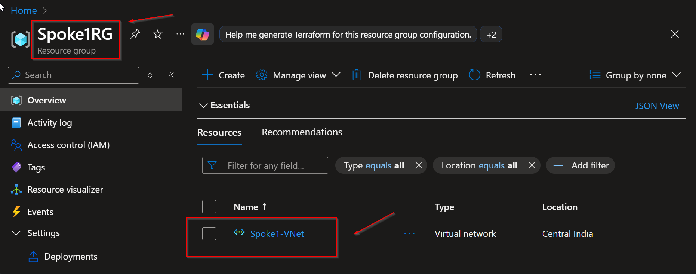

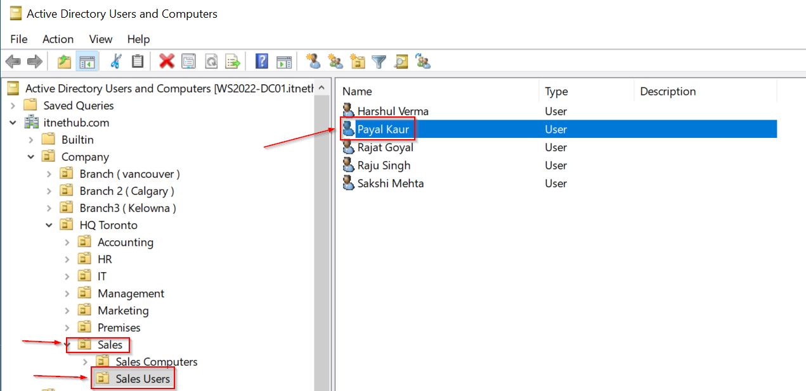

---

## 4. Shared Drive Mapping via GPO

### Scenario

Map `S:` drive automatically for all users in the **Sales Users OU** so they don't need to contact IT each time.

### Steps to Map S: Drive for Sales Users

1. Open **Group Policy Management Console (GPMC)**.
2. Right-click the **Sales Users OU** → **Create a GPO in this domain and link it here**.
3. Name it (e.g., `Sales-Drive-Mapping`) and click **OK**.
4. Right-click the GPO → **Edit**.
5. Navigate to:  
   `User Configuration > Preferences > Windows Settings > Drive Maps`
6. Right-click → **New > Mapped Drive**.
7. Set:
   - **Action:** Create
   - **Location:** `\\<ServerName>\Sales` (your share path)
   - **Drive Letter:** `S:`
   - **Label:** Sales Files
8. Under the **Common** tab, check **Item-level targeting** and target `OU=Sales Users`.
9. Click **OK** and close the editor.

When users in the Sales Users OU next log in, the `S:` drive will be automatically mapped.

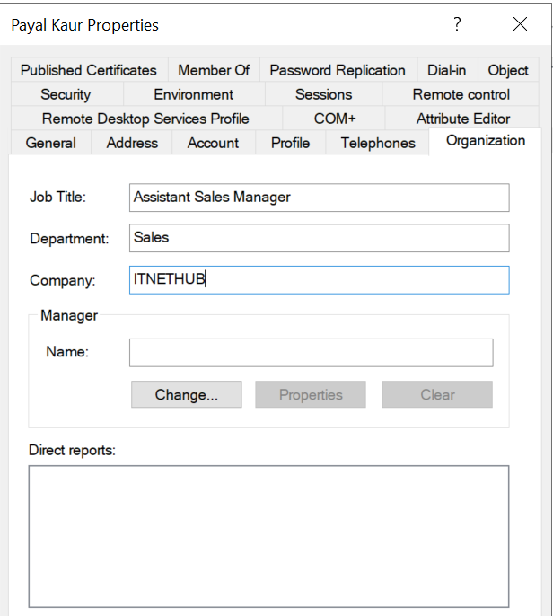

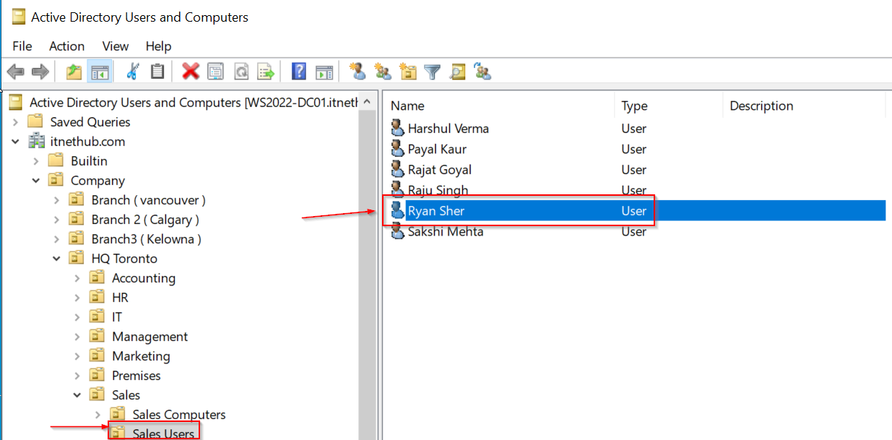

---

## 5. GPO Baseline & Policy Hygiene

A GPO baseline is a set of standard policies serving as a foundation for system configuration and security. Policy hygiene means regularly reviewing, updating, and removing outdated or redundant GPOs.

**Best Practices:**
- Document all changes with clear, descriptive naming conventions.
- Periodically audit GPOs to ensure they are still relevant and correctly applied.
- Align new GPOs with established baselines to prevent configuration drift.

### Copy ADMX Templates to Central Store

```powershell
# Run as Domain Admin on a DC or management host
$domain = $env:USERDNSDOMAIN
$target = "\\$domain\SYSVOL\$domain\Policies\PolicyDefinitions"

New-Item -Path $target -ItemType Directory -Force
robocopy "C:\Windows\PolicyDefinitions" $target /MIR
```

### Create Baseline GPO

```powershell
Import-Module GroupPolicy
New-GPO -Name "Domain-Baseline" -Comment "Security baseline: firewall, auditing, account lockout"
```

### Lab Implementation

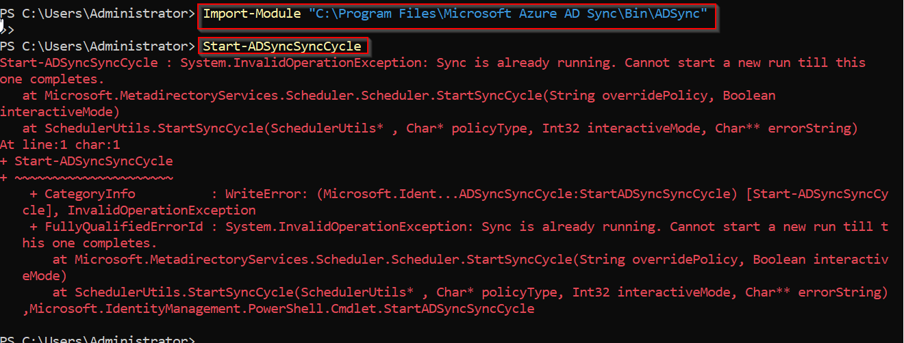

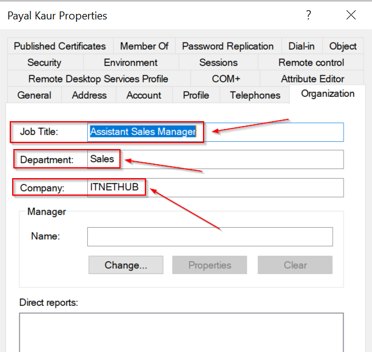

---

## 6. Password Policy

Configure a strong domain password policy via GPMC:

**Path:** `Computer Configuration > Policies > Windows Settings > Security Settings > Account Policies > Password Policy`

**Recommended Settings:**
| Setting | Value |
|---|---|
| Minimum password length | 12 characters |
| Password complexity | Enabled |
| Maximum password age | 60 days |
| Minimum password age | 1 day |
| Password history | 24 passwords |

### PowerShell Alternative

```powershell
Import-Module ActiveDirectory

Set-ADDefaultDomainPasswordPolicy `
    -Identity            "itnethub.com" `
    -MinPasswordLength   12 `
    -PasswordHistoryCount 24 `
    -ComplexityEnabled   $true `
    -MaxPasswordAge      (New-TimeSpan -Days 60) `
    -MinPasswordAge      (New-TimeSpan -Days 1)
```

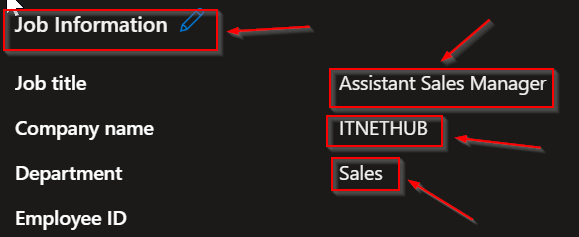

---

## 7. Automated Security Group Creation

This script creates **Users** and **Computers** sub-OUs and all required security groups for every department OU under `OU=HQ Toronto,OU=Company,DC=itnethub,DC=com`.

```powershell
Import-Module ActiveDirectory

$ParentOU = "OU=HQ Toronto,OU=Company,DC=itnethub,DC=com"

try {
    $DepartmentOUs = Get-ADOrganizationalUnit -Filter * -SearchBase $ParentOU `
                     -SearchScope OneLevel -ErrorAction Stop
} catch {
    Write-Host "Error: Could not find the parent OU: $ParentOU" -ForegroundColor Red
    return
}

foreach ($DeptOU in $DepartmentOUs) {
    $DeptName = $DeptOU.Name
    Write-Host "Processing OU: $DeptName" -ForegroundColor Cyan

    # Create sub-OUs
    foreach ($subOuName in "$DeptName Users", "$DeptName Computers") {
        if (-not (Get-ADOrganizationalUnit -Filter "Name -eq '$subOuName'" -SearchBase $DeptOU.DistinguishedName -SearchScope OneLevel -ErrorAction SilentlyContinue)) {
            New-ADOrganizationalUnit -Name $subOuName `
                -Path $DeptOU.DistinguishedName `
                -ProtectedFromAccidentalDeletion $true
            Write-Host "  Created OU: $subOuName" -ForegroundColor DarkGreen
        } else {
            Write-Host "  Skipping '$subOuName' — already exists." -ForegroundColor Yellow
        }
    }

    # Create security groups
    $groupNames = @(
        "$DeptName Management",
        "$DeptName team",
        "${DeptName}_Read_Only",
        "${DeptName}_team_Write",
        "${DeptName}_Write"
    )

    foreach ($groupName in $groupNames) {
        if (-not (Get-ADGroup -Filter { Name -eq $groupName } -ErrorAction SilentlyContinue)) {
            New-ADGroup -Name $groupName `
                -Path $DeptOU.DistinguishedName `
                -GroupScope 'Global' `
                -GroupCategory 'Security'
            Write-Host "  Created group: $groupName" -ForegroundColor Green
        } else {
            Write-Host "  Skipping '$groupName' — already exists." -ForegroundColor Yellow
        }
    }
}

Write-Host "Script finished." -ForegroundColor Blue
```

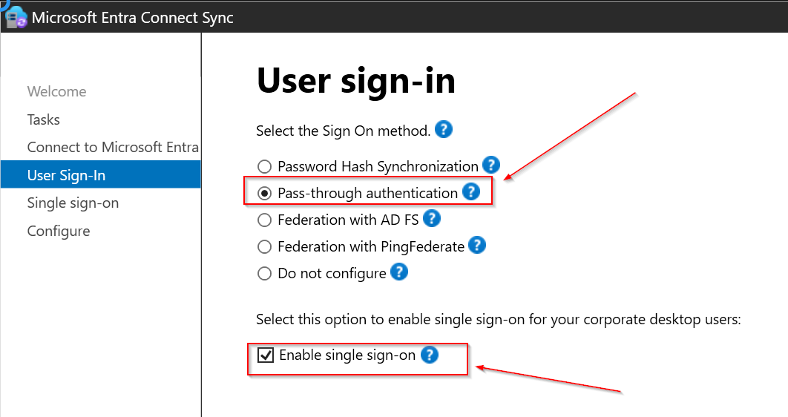

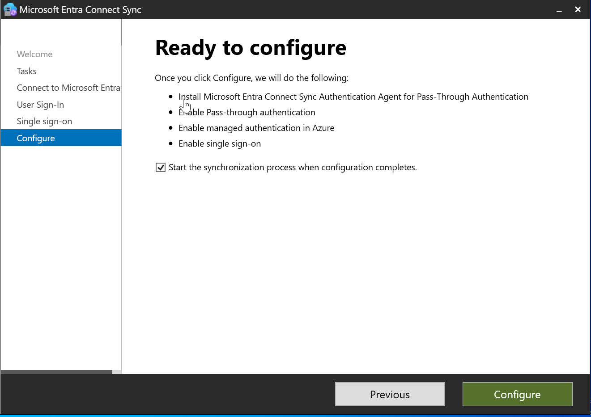

---

## 8. Google Chrome Deployment via GPO

### Overview

For fully automated Chrome installation in a domain, use Group Policy to deploy the **Chrome Enterprise MSI** installer.

**Steps:**
1. Place the Chrome Enterprise MSI in a network-shared folder accessible by all target machines.
2. Open GPMC and create or modify a GPO.
3. Navigate to:  
   `Computer Configuration > Policies > Software Settings > Software Installation`
4. Right-click → **New > Package** → Browse to the MSI → Select **Assigned**.
5. Chrome installs automatically on domain computers at startup.
6. Import Chrome **ADMX/ADML** templates into Group Policy for additional browser configuration.

### Lab Setup — Chrome Installation GPO

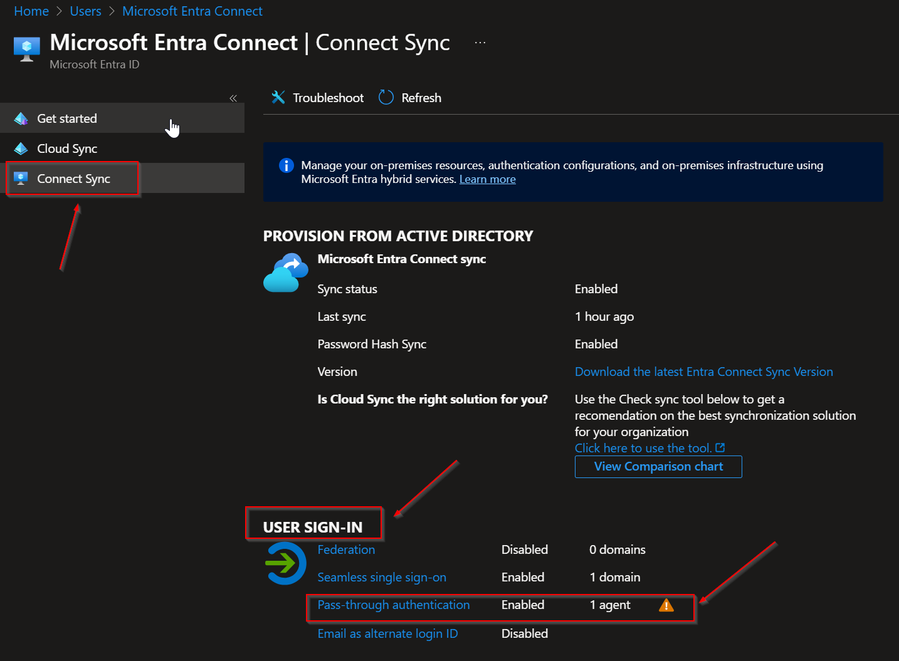

### Lab Setup — Chrome Default Settings GPO

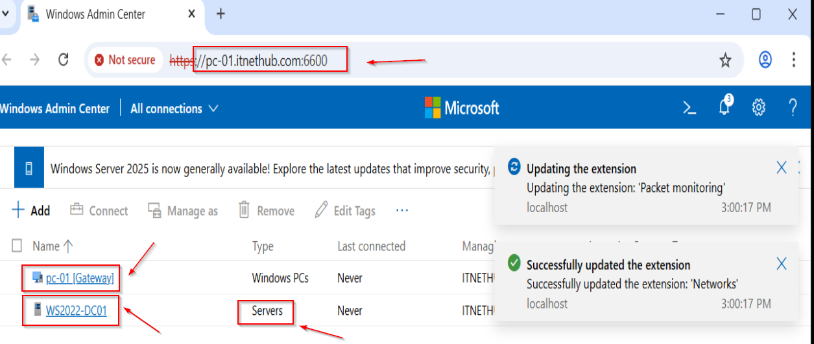

### Result — Chrome Installed

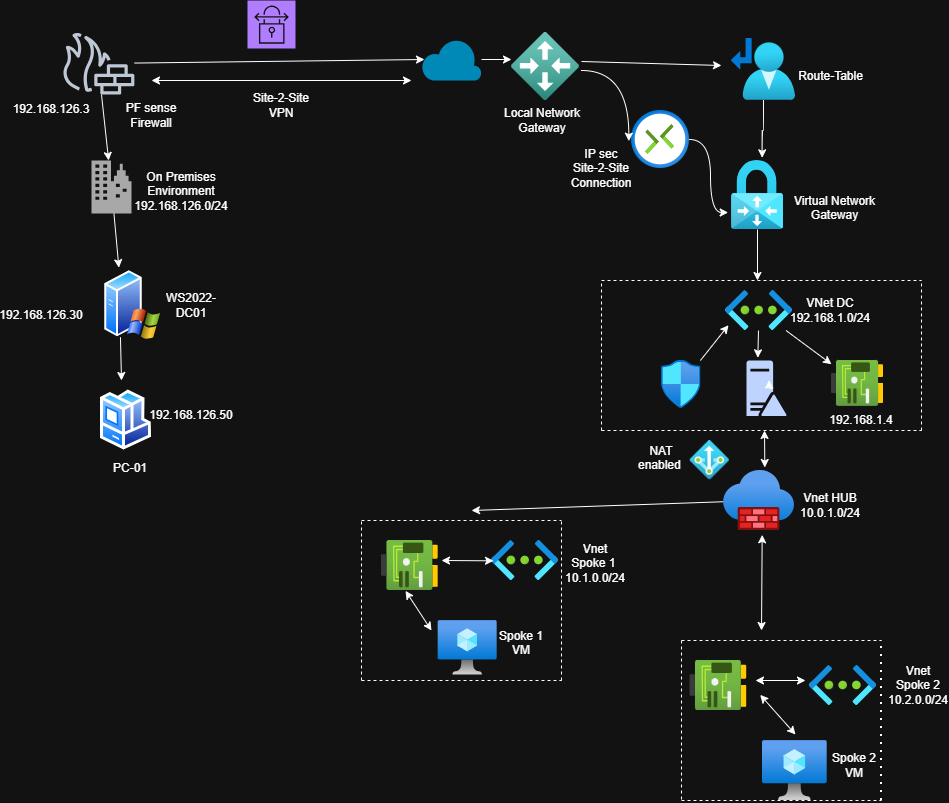

### Result — Default Page Showing

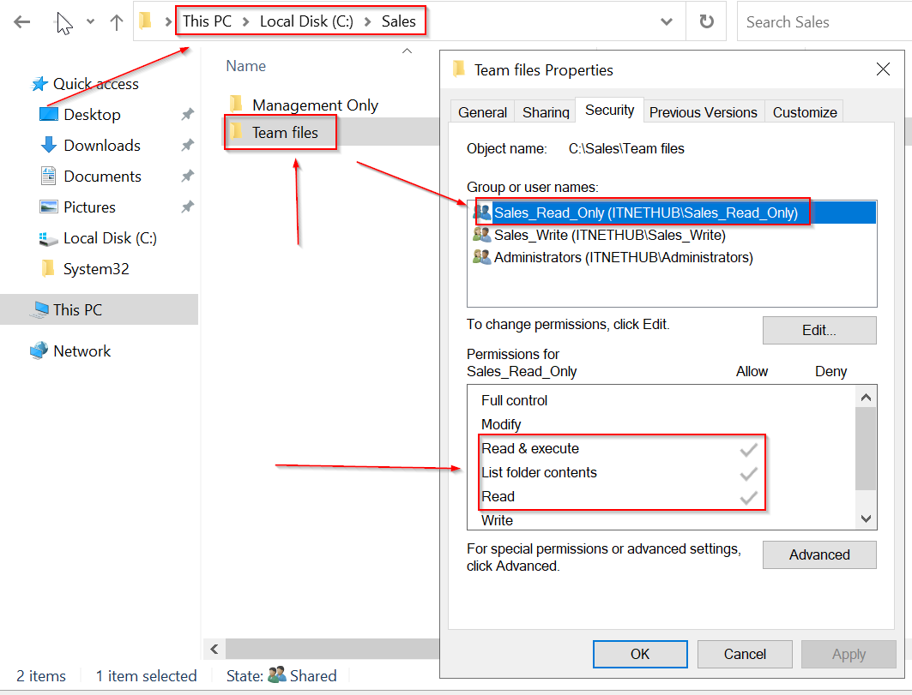

---

## 9. Microsoft Entra Connect — Download, Install & Configure

### Scenario

> You're now ready to implement the integration by downloading Microsoft Entra Connect, installing it on DC, and configuring its settings to match the integration objective.

**Objective:** After completing these steps, `WS2022-DC01` will be integrated with Azure AD using Microsoft Entra Connect. Monitor synchronisation status and review logs for any issues.

### Main Tasks

1. Download Microsoft Entra Connect from the Microsoft portal or the official documentation page.
2. Run the installer on your Domain Controller (`WS2022-DC01`).
3. Follow the setup wizard — choose **Express Settings** for a standard single-forest configuration.
4. Provide your **Azure AD Global Admin** credentials and your **AD DS Enterprise Admin** credentials when prompted.
5. Review the configuration summary and click **Install**.
6. After installation completes, allow the initial synchronisation cycle to run.

### Lab Setup Screenshots

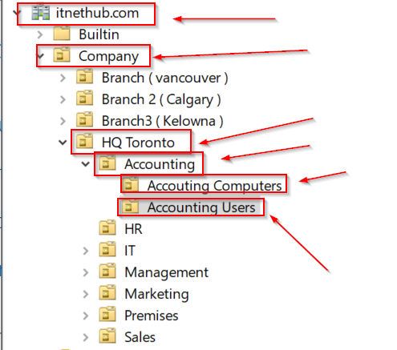

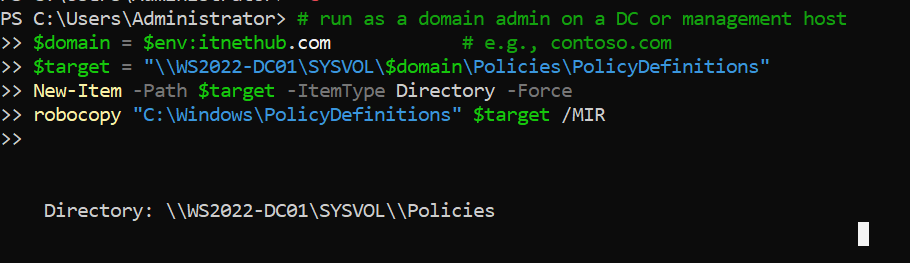

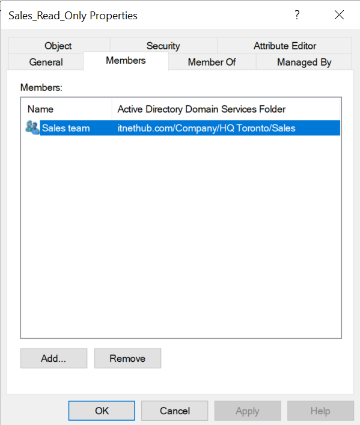

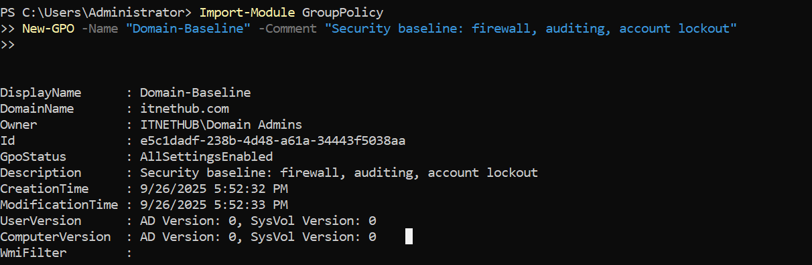

---

## 10. Verifying AD DS ↔ Entra ID Synchronisation

### Scenario

> Now that Microsoft Entra Connect is installed and configured, verify its synchronisation mechanism by making changes to on-premises user accounts and confirming they replicate to Microsoft Entra ID.

### Main Tasks

#### Task 1 — Verify in Synchronisation Service Manager

1. On the server running Microsoft Entra Connect, open **Synchronisation Service Manager** (`miisclient.exe`).
2. In the **Operations** tab, review recent synchronisation runs for errors or warnings.
3. Locate the **Export** and **Import** steps to confirm data flow to Microsoft Entra ID.
4. Use the **Connectors** tab to inspect connector spaces and verify expected updates.

#### Task 2 — Update a User Account in Active Directory

1. Open **Active Directory Users and Computers** on your domain controller.
2. Locate user **Payal Kaur** in the Sales OU, right-click → **Properties**.
3. Modify an attribute (e.g., Job Title or Department) → **OK**.

#### Task 3 — Create a New User in Active Directory

1. In ADUC, right-click the appropriate OU → **New > User**.
2. Fill in the user details (name, logon name) and set a password.
3. Complete the wizard and confirm the new user appears in the directory.

#### Task 4 — Force Delta Sync to Microsoft Entra ID

```powershell
# Run on the server with Microsoft Entra Connect (as administrator)
Start-ADSyncSyncCycle -PolicyType Delta
```

Wait for the synchronisation cycle to complete. Monitor progress in Synchronisation Service Manager.

#### Task 5 — Verify Changes in Microsoft Entra ID

1. Go to **Azure Portal** → **Microsoft Entra ID** → **Users**.
2. Search for the updated or newly created user.
3. Open the user's profile and confirm the changes are reflected.

### Lab Screenshots — On-Premises Changes Made

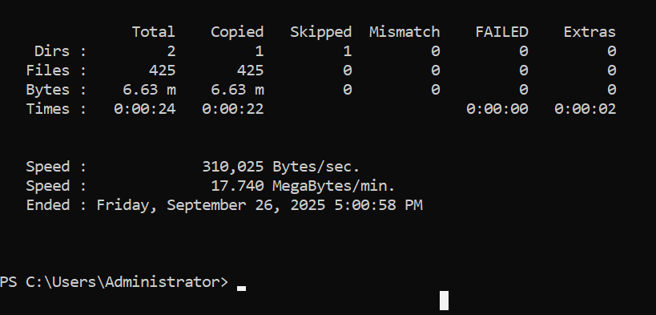

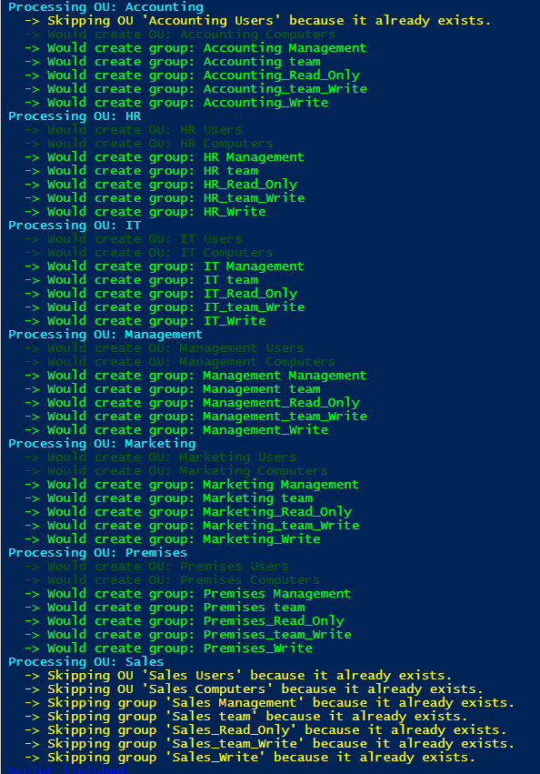

### Lab Screenshots — Changes Reflected via Sync

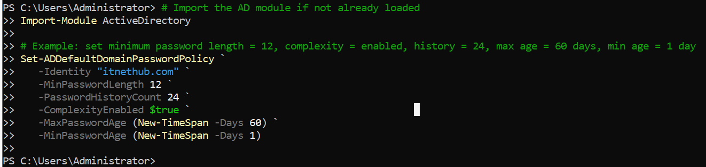

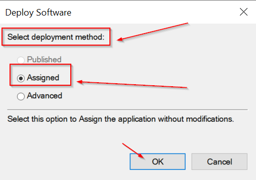

---

## 11. Entra ID Integration Features in AD DS

### Main Tasks

#### Enable Password Writeback in Microsoft Entra Connect

1. Open **Microsoft Entra Connect** on the DC.
2. Select **Configure** → **Customize synchronization options**.
3. On the **Optional Features** page, enable **Password writeback**.
4. Complete the wizard and allow the configuration to apply.

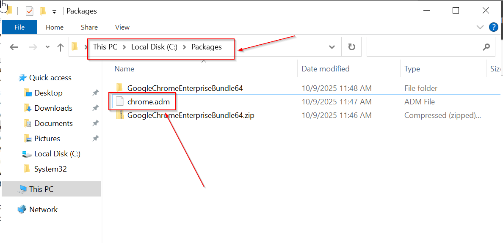

#### Pass-Through Authentication (PTA) Setup

You will see this screen when setting up PTA:

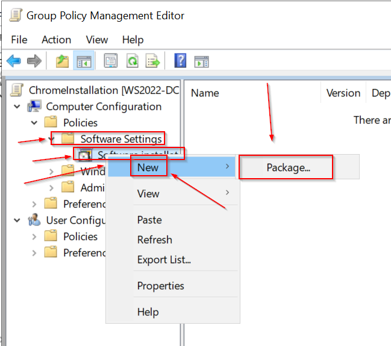

After Azure and on-premises credentials are authenticated:

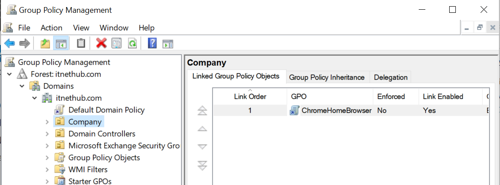

### Install and Register Entra ID Password Protection

1. Download the **Microsoft Entra ID Password Protection proxy service** and **DC agent** installers from the official Microsoft documentation.
2. Install the **proxy service** on a member server (or the DC for lab purposes).
3. Install the **DC agent** on all domain controllers.
4. Open a command prompt as administrator and register the proxy:

```cmd
AzureADPasswordProtectionProxy.exe RegisterProxy /AzureTenantId <YourTenantId>
```

> Replace `<YourTenantId>` with your actual Azure AD tenant ID. Run this command in the directory where the proxy service was installed. Refer to [Microsoft Entra ID Password Protection documentation](https://learn.microsoft.com/en-us/entra/identity/authentication/howto-password-ban-bad-on-premises-deploy) for full details.

---

## 12. Windows Admin Center — Install & Configure

### Objectives

Install Windows Admin Center (WAC) and configure it for managing hybrid Windows Server infrastructure.

**Reference guide:**  
[AZ-800 Lab 03 — Managing Windows Server](https://microsoftlearning.github.io/AZ-800-Administering-Windows-Server-Hybrid-Core-Infrastructure/Instructions/Labs/LAB_03_Managing_Windows_Server.html)

### Main Tasks

1. Download the Windows Admin Center installer from the [official Microsoft page](https://aka.ms/windowsadmincenter).
2. Run the `.msi` installer on the management server or DC.
3. Choose the port (default: `443`) and install a self-signed certificate for lab use.
4. Complete the installation and open `https://localhost` in a browser.
5. Log in with domain admin credentials.

### Lab Setup — WAC Dashboard After Login

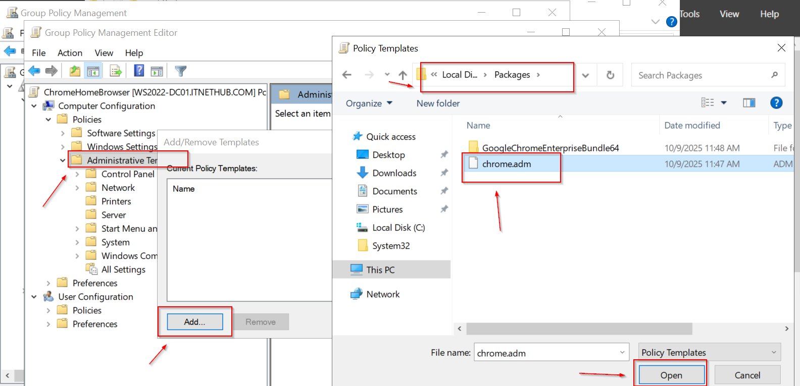

> **Note:** `AppIDSvc` refers to the **Application Identity** service in Windows — it determines and verifies the identity of an application. It may appear in WAC service management views.

---

## 13. WAC in Hybrid Scenarios (Azure Network Adapter)

### Reference

[AZ-800 Lab 04 — Using Windows Admin Center in Hybrid Scenarios](https://microsoftlearning.github.io/AZ-800-Administering-Windows-Server-Hybrid-Core-Infrastructure/Instructions/Labs/LAB_04_Using_Windows_Admin_Center_in_hybrid_scenarios.html)

### Task — Test Hybrid Connectivity Using Azure Network Adapter

1. In **Windows Admin Center**, connect to your server.
2. Navigate to **Networks** → **+ Add Azure Network Adapter**.
3. Sign in to your Azure account when prompted.
4. Select your **Subscription**, **Resource Group**, **Location**, and **Gateway**.
5. Specify the IP address for the network adapter.
6. Click **Create** — WAC will provision the Azure VPN Gateway and configure the adapter automatically.
7. Once the adapter is configured, verify connectivity by attempting to access resources in the connected Azure Virtual Network from your on-premises server.

---

## 14. Azure VM Deployment

### Pre-requisite — Create Azure Resource Group

Before deploying VMs, create a resource group. The lab uses resource group **AZ-800**:

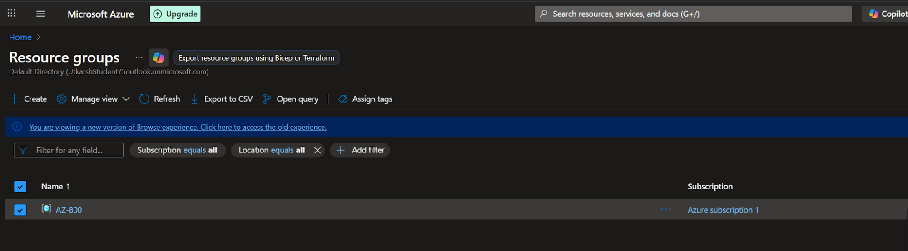

### Approach A — Azure Portal (GUI)

1. Sign in to [portal.azure.com](https://portal.azure.com).
2. In the search bar, type **Virtual Machines** and open the service.
3. Click **Create** → **Azure virtual machine**.
4. On the **Basics** tab:
   - **Subscription:** Choose your subscription.
   - **Resource group:** Create new or select existing (e.g., `AZ-800`).
   - **Virtual machine name:** e.g., `myVM`.
   - **Region:** e.g., East US.
   - **Image:** Windows Server 2022 Datacenter.
   - **Size:** Accept default or choose another.
   - **Username / Password:** Create admin credentials.
   - **Public Inbound ports:** Allow RDP (3389).
5. Click **Review + Create** → Review settings → **Create**.
6. Wait for deployment, then click **Go to resource**.

### Approach B — Azure Cloud Shell (PowerShell)

```powershell
# 1. Create a resource group
New-AzResourceGroup -Name "myResourceGroup" -Location "EastUS"

# 2. Create the VM (also creates supporting resources)
New-AzVM `
    -ResourceGroupName "myResourceGroup" `
    -Name              "myVM" `
    -Location          "EastUS" `
    -Image             "Win2022Datacenter" `
    -Credential        (Get-Credential) `
    -OpenPorts         3389

# 3. Get the public IP after deployment
Get-AzPublicIpAddress -ResourceGroupName "myResourceGroup" | Select IpAddress
```

You will be prompted for a username and password — this becomes the admin account for the VM.

### Lab Result — VM Created via PowerShell

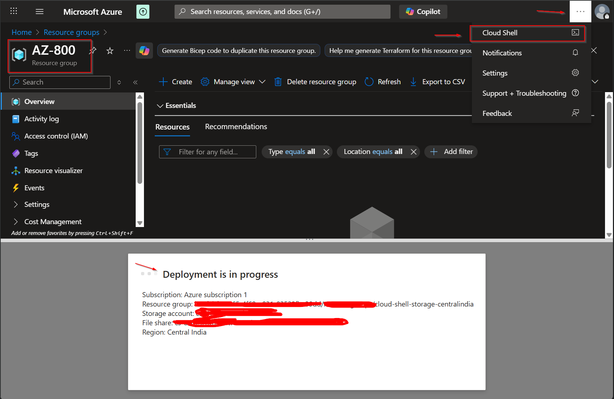

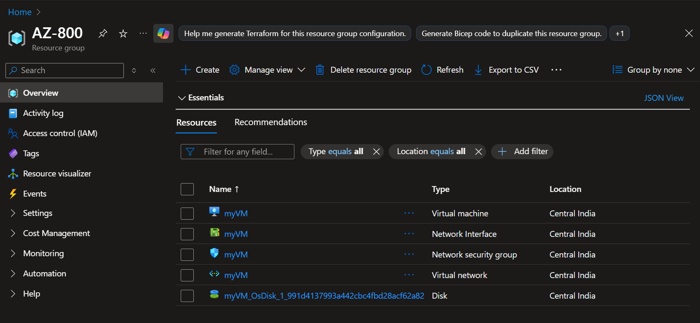

---

## 15. Installing and Configuring Containers

To install and configure containers on Windows Server:

1. **Install the Containers feature** — Open PowerShell as an administrator and run:
   ```powershell
   Install-WindowsFeature -Name Containers
   ```
2. **Restart the server** — After the feature installs, restart to apply changes.
3. **Install Docker:**
   ```powershell
   Install-Module -Name DockerMsftProvider -Repository PSGallery -Force
   Install-Package -Name docker -ProviderName DockerMsftProvider
   ```
4. **Start the Docker service:**
   ```powershell
   Start-Service docker
   ```
5. **Verify installation:**
   ```cmd
   docker version
   ```
6. **Configure containers** — Pull container images, run containers, and manage them:
   ```cmd
   docker pull mcr.microsoft.com/windows/servercore:ltsc2022
   docker run -it mcr.microsoft.com/windows/servercore:ltsc2022
   docker ps
   ```

---

## 16. ARM Templates

Azure Resource Manager (ARM) templates are **JSON-based files** used to define and automate deployment of Azure infrastructure. They are central to the **Infrastructure as Code (IaC)** approach in Azure.

When you deploy an ARM template, Azure Resource Manager reads it and translates resource definitions into corresponding REST API operations.

### Core Components

An ARM template has five key sections:

| Section | Purpose |
|---|---|
| **Parameters** | Input variables like region, VM size, or password |
| **Variables** | Reusable values to avoid duplication |
| **User-defined Functions** | Custom logic or reusable calculations |
| **Resources** | Core section — defines Azure resources (VMs, VNets, storage) |
| **Outputs** | Return values after deployment (IP addresses, resource IDs) |

```json
{
  "$schema": "https://schema.management.azure.com/schemas/2019-04-01/deploymentTemplate.json#",
  "contentVersion": "1.0.0.0",
  "parameters": {},
  "variables": {},
  "resources": [],
  "outputs": {}
}
```

### Deployment Process

1. Write the ARM template in JSON format.
2. Choose a deployment method — Azure Portal, CLI, PowerShell, REST API, or GitHub.
3. Azure Resource Manager validates the template.
4. Resource Manager converts each resource definition into REST API calls using the `apiVersion` specified.
5. Resources are deployed in order or in parallel depending on dependencies.

### Benefits

- **Consistency** — Every environment (dev, test, prod) is identical.
- **Repeatability** — Reuse templates across teams or projects.
- **Automation** — Enable CI/CD integration for continuous deployments.
- **Version Control** — Store templates in Git to track changes.
- **Reduced Errors** — Templates are pre-validated by Azure before deployment.

### Lab Mini Project — ARM Deployment to Azure

#### Step 1 — Install and Connect Azure PowerShell Module

```powershell
# Install the module if not already installed
Install-Module -Name Az -AllowClobber -Scope CurrentUser

# Import the accounts module
Import-Module Az.Accounts

# Sign in (standard prompt)
Connect-AzAccount

# Alternative — use device code if the above doesn't work
Connect-AzAccount -DeviceCode
```


#### Step 2 — Select Your Subscription

```powershell
Get-AzSubscription
```

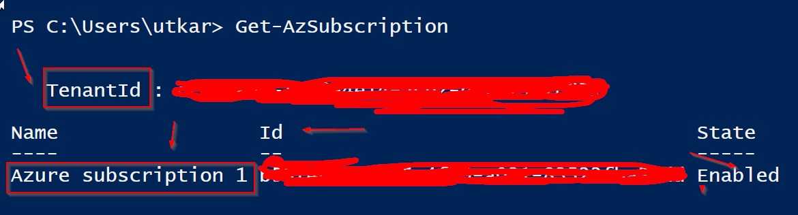

```powershell
Select-AzSubscription -Subscription "<Name or ID of your Azure Subscription>"
```

#### Step 3 — Create Resource Group

```powershell
New-AzResourceGroup -Name "ARMTest" -Location "Central India"
```

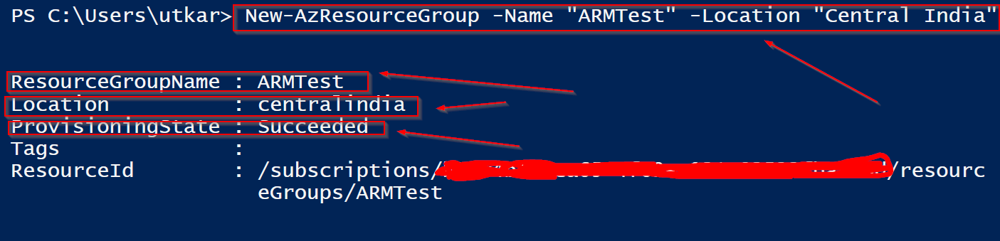

#### Step 4 — Declare Template Variable and Deploy

```powershell
$templateFile = ".\deploymentTemplate.json"

New-AzResourceGroupDeployment `
    -Name              "TestDeployment" `
    -ResourceGroupName "ARMTest" `
    -TemplateFile      $templateFile
```

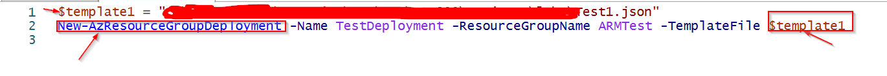

#### Step 5 — Verify Deployment Output

You should receive output like this:

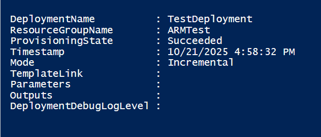

#### Step 6 — Verify in Azure Portal

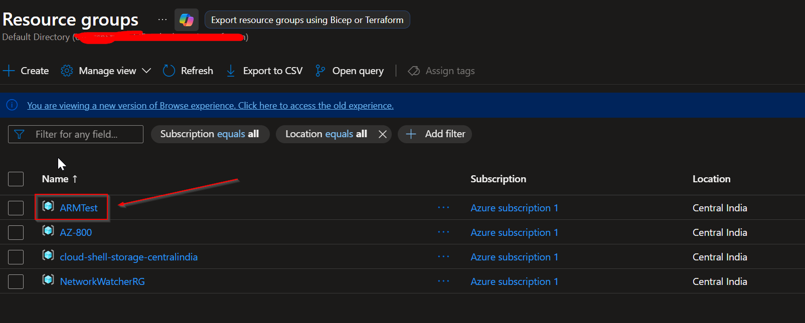

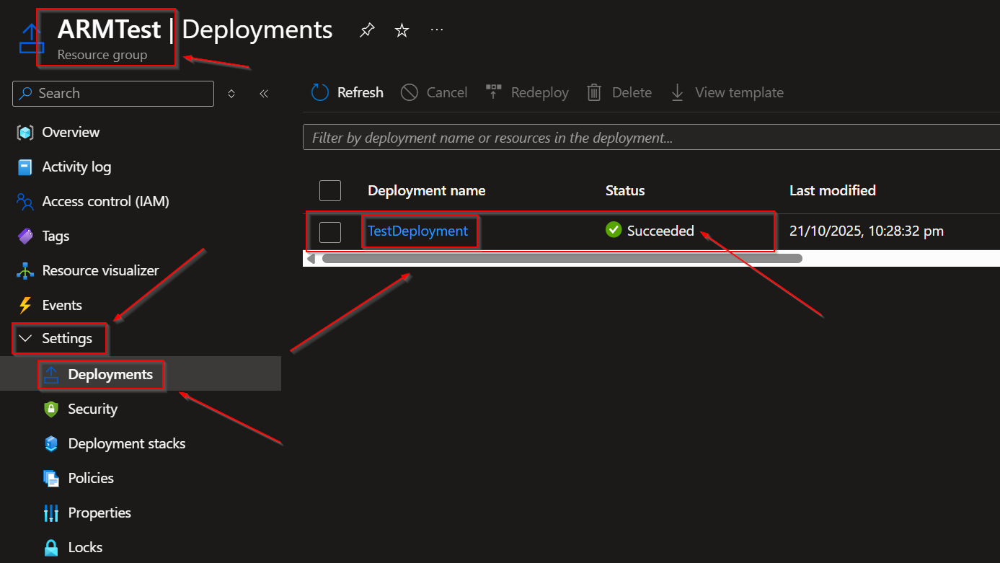

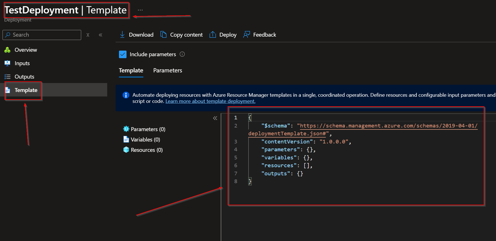

---

## 17. Connecting On-Prem DC to Azure (Site-to-Site VPN)

### Architecture Overview

| Component | Network | Details |
|---|---|---|
| On-premises DC | `192.168.126.0/24` | VMware Workstation — Primary DC for `itnethub.com` |
| Azure VMs | `192.168.1.0/24` | Azure VNet — Secondary DCs / DHCP servers |
| pfSense | WAN (Bridged) / LAN `192.168.126.1` | On-prem VPN gateway |
| Connectivity | Site-to-Site VPN | Tunnel between pfSense and Azure VPN Gateway |

### Step 1 — Configure Site-to-Site VPN

You must create a secure tunnel between your VMware on-prem network and Azure's VNet using a **VPN Gateway**.

#### Azure Side Steps

1. Create an Azure **VNet** with address space `192.168.1.0/24`.
2. Add a **GatewaySubnet** (e.g., `192.168.1.224/27`) inside that VNet.
3. Create a **Virtual Network Gateway** (VPN type: Route-based, SKU: VpnGw1 or higher).
4. Create a **Local Network Gateway** for your on-prem network:
   - Address space: `192.168.126.0/24`
   - Public IP: your home router or pfSense external IP.
5. Create a **Site-to-Site connection** between Azure and the on-prem VPN gateway using a **shared key (PSK)**.

#### Lab Screenshot — Azure Environment (VNet + Gateway)

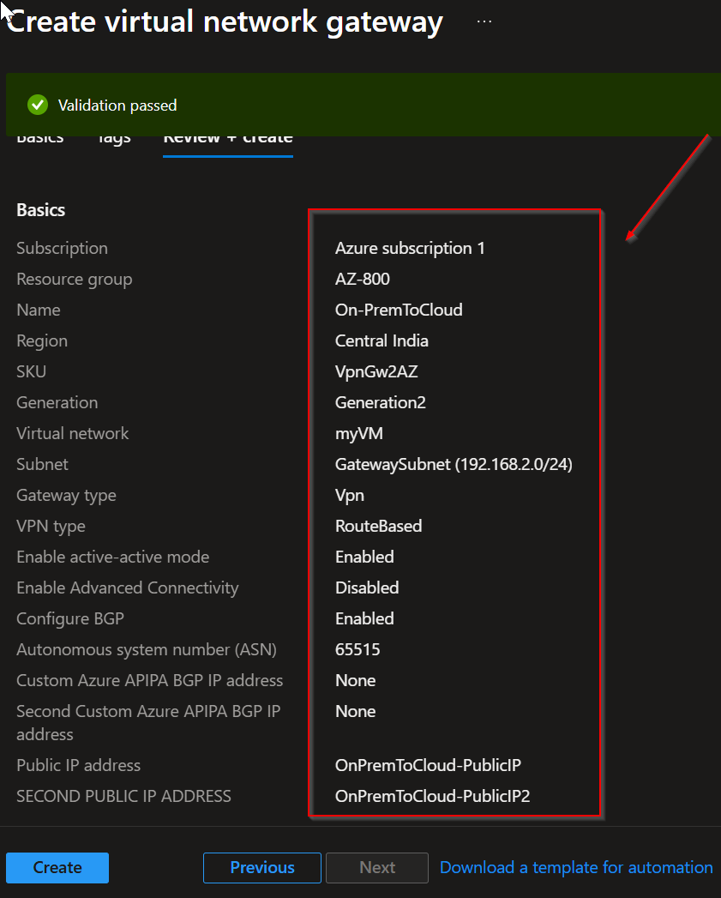

### Step 2 — Create Local Network Gateway

The **Local Network Gateway (LNG)** is an Azure resource representing your on-premises network within Azure. It stores:
- The **public IP address** of your on-prem VPN device (pfSense, RRAS, etc.)
- Your **on-prem network address ranges** (e.g., `192.168.126.0/24`)

**How it fits in the architecture:**
- In Azure, you deploy a **Virtual Network Gateway** to represent the Azure side of the VPN.
- You create a **Local Network Gateway** describing the on-prem environment (its public IP and LAN address space). Azure uses this to route traffic to your on-prem network over the tunnel.
- On-prem, you configure **pfSense** to match Azure's public VPN Gateway IP and shared key.

#### Lab Screenshot — Local Network Gateway Setup

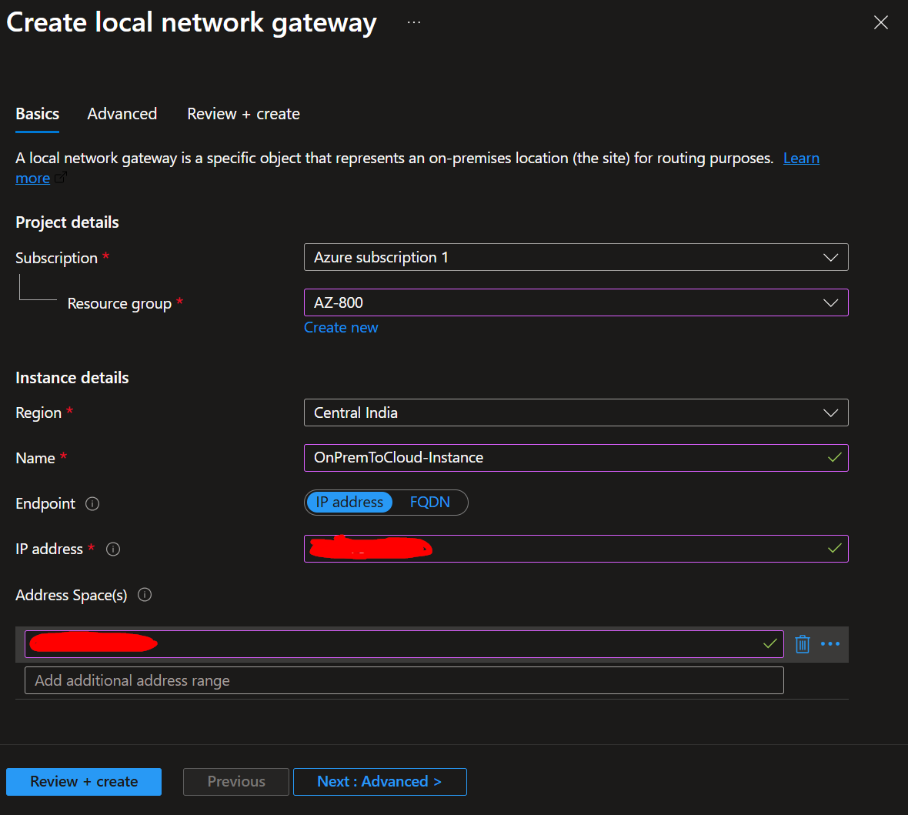

> You can find your public IP address by searching "what is my IP" in a browser. For address space, use the IP address space of your Windows Server environment.

After the Local Network Gateway is created, go to:  
**Local Network Gateway → Settings → Connections**  
The connection links your local network to the Azure network.

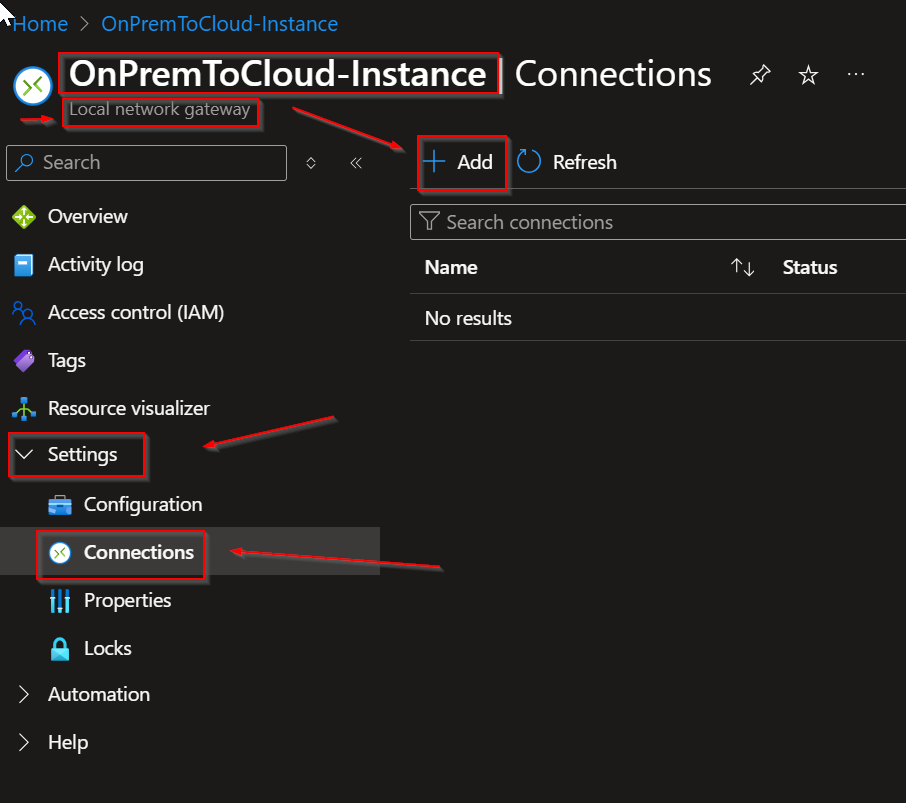

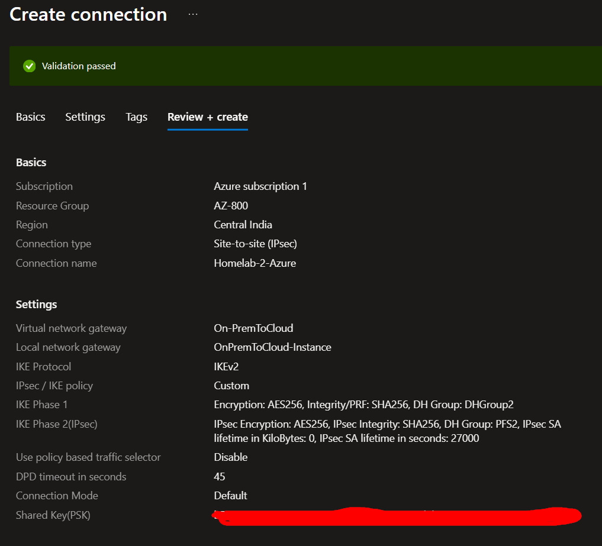

### Step 3 — Configure pfSense IPsec

**Topology:**
```
Internet ↔ pfSense (WAN/Bridged) ↔ pfSense LAN 192.168.126.1 ↔ On-prem DC + VMs (192.168.126.0/24)
```

On pfSense, configure the IPsec tunnel:

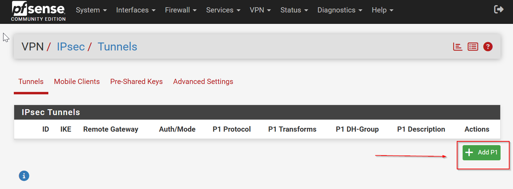

Copy the **Public IP address** from your Azure Virtual Network Gateway:

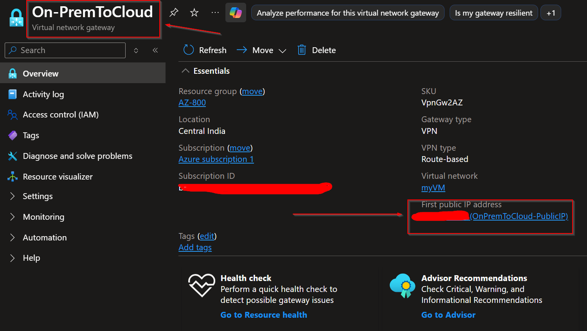

### Step 4 — Configure IPsec Phase 1 on pfSense

In pfSense: **VPN → IPsec → Tunnels → Edit Phase 1**

Use the Azure VPN Gateway public IP as the remote gateway. Follow the screenshot below:

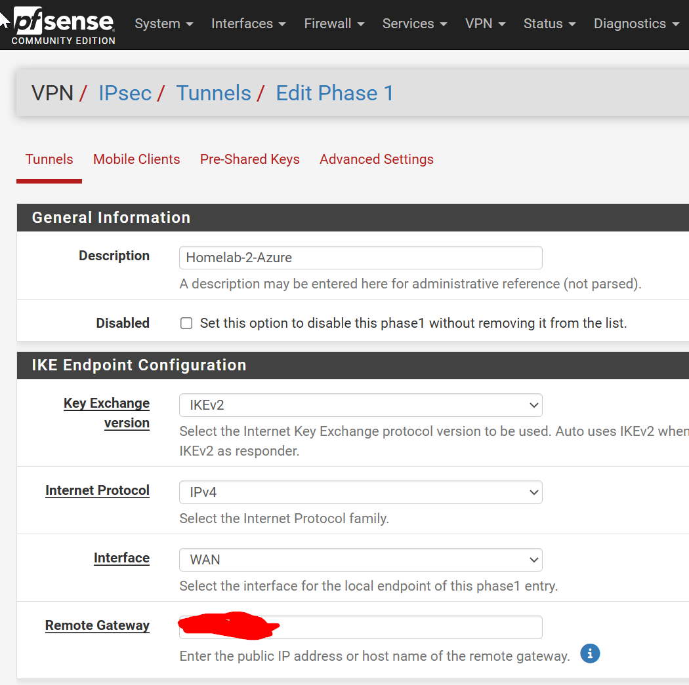

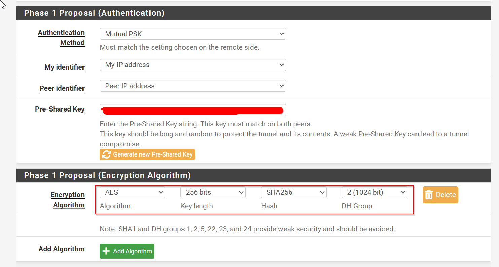

Click **Save** at the end of the page, then **Apply Changes**, then click **Phase 2**.

### Step 5 — Configure IPsec Phase 2 on pfSense

Fill out the **Local Network** and **Remote Network** sections:

**1. Local Network** — This is your on-prem network behind pfSense where your DC lives.
- **Type:** Network
- **Address:** `192.168.126.0`
- **Subnet:** `/24`

**2. Remote Network** — This is your Azure subnet where Azure VMs are running.
- **Type:** Network
- **Address:** Your Azure VNet subnet (e.g., `192.168.1.0` or `10.1.0.0`)
- **Subnet:** `/24` (or match your Azure VNet setup)

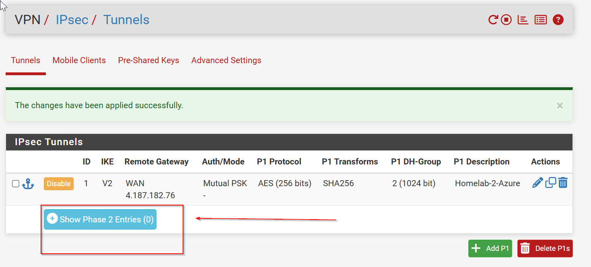

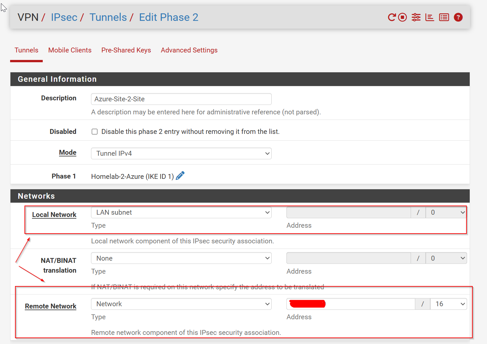

### Step 6 — Connect and Verify Tunnel

Go to **Status → IPsec**:

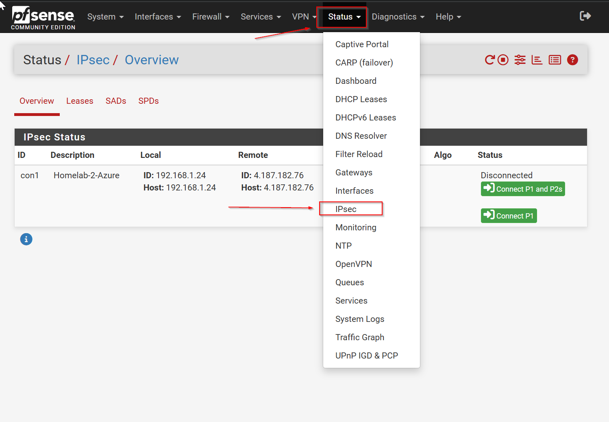

Click **Connect P1 and P2s**. If settings are correct, the connection will be established. Verify in Azure:

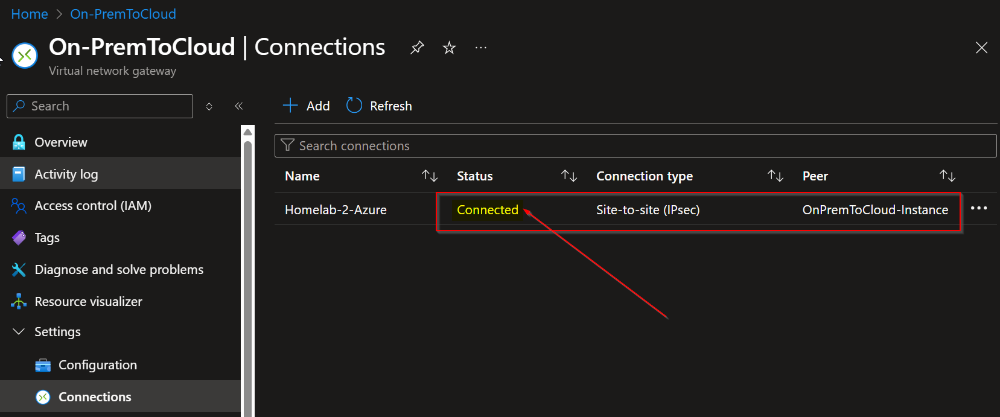

---

## 18. Domain Joining Azure VM to On-Prem DC

After the VPN is established, pinging the on-prem DC from Azure may still fail. Follow these steps to resolve the issue.

### 1. Confirm Bidirectional Routing

**On pfSense:**
- Go to **VPN → IPsec → Status Overview** to confirm tunnel is "Established".
- Under **VPN → IPsec → Tunnels → Phase 2**, ensure:
  - Local network: `192.168.126.0/24`
  - Remote network: `192.168.1.0/24`
- Go to **Firewall → Rules → IPsec** and add a rule allowing required traffic (DNS, LDAP, Kerberos, SMB, RPC — ports 53, 88, 135, 389, 445, 636, 3268, 3269).

**In Azure:**
- Ensure the VNet address space includes `192.168.1.0/24` and the **Local Network Gateway** has `192.168.126.0/24`.
- Create a **User Defined Route (UDR)**:
  - Next hop: Virtual Network Gateway
  - Route: `192.168.126.0/24`
  - Associate with the Azure subnet containing your VM.

### 2. Configure DNS Correctly in Azure

Simply setting the VNet DNS to `192.168.126.30` often fails without proper VPN path and firewall permissions. Configure properly:

- **VNet DNS settings:** Set Custom DNS to `192.168.126.30` (your on-prem DNS/DC IP).
- Ensure the DNS server allows recursive queries from the remote Azure subnet `192.168.1.0/24`.
- On pfSense under **Services → DNS Resolver → Access Lists**, add the Azure subnet as allowed clients.
- If using Unbound, add a **Domain Override** for your AD domain to forward queries to the DC.

**Test DNS:**
```text
nslookup yourdomain.local 192.168.126.30
```
If this fails, DNS queries are not passing through the tunnel.

### 3. Verify Port Access for Domain Join

Open the following ports on pfSense's IPsec rules tab:
- TCP/UDP 53 — DNS
- TCP/UDP 88 — Kerberos
- TCP 135 — RPC
- TCP/UDP 389, 636 — LDAP/LDAPS
- TCP 445 — SMB
- TCP 3268–3269 — Global Catalog

> You can temporarily set an **"Allow all any-any"** rule under IPsec for testing, then tighten it afterward.

### 4. Connectivity Tests

On the Azure VM:
```cmd
ping 192.168.126.30
telnet 192.168.126.30 53
```
```powershell
Test-ComputerSecureChannel -Verbose   # after joining attempt
```

If ping or DNS fails, likely causes are:
- pfSense does not pass return traffic (missing static route).
- Azure subnet lacks a UDR to route back.

### Lab Implementation

#### Change DNS on Azure VNet to On-Prem DC IP

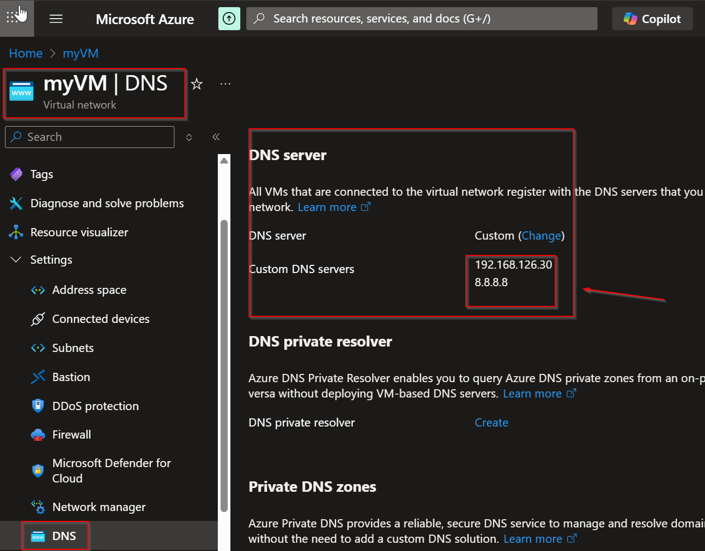

#### Create Route Table in Azure

1. Search for **Route tables** in the Azure Portal.
2. Click **+ Create** to create a new route table.

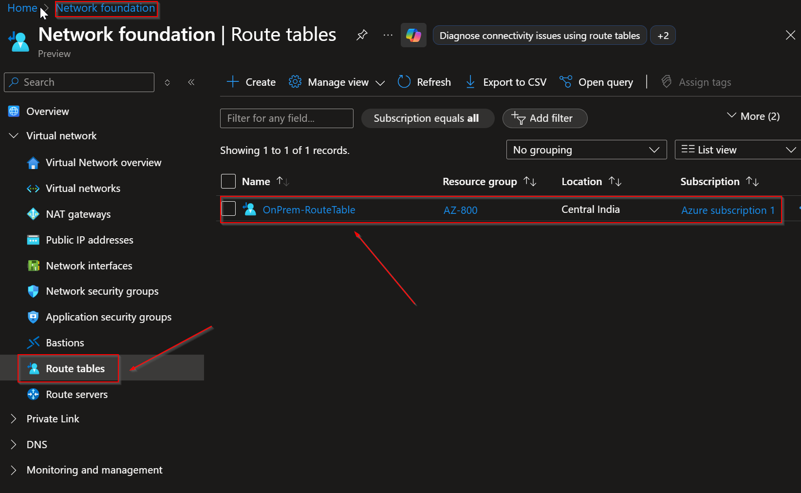

After creating a route table, create a route inside it:

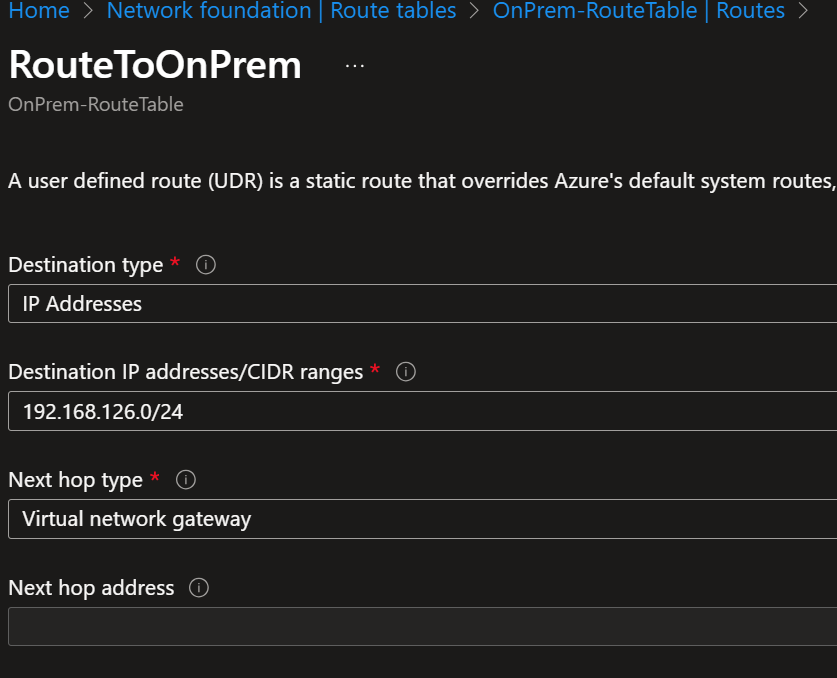

**Where and How to Create a UDR in Azure Portal:**

1. Log in to the Azure Portal.
2. Search for and select **Route tables**.
3. Click **+ Create** / **+ Add**.
4. Fill in required details:
   - **Name:** e.g., `OnPrem-RouteTable`
   - **Subscription:** Your Azure subscription
   - **Resource Group:** Same as your Azure VNet
   - **Region:** Same as your VNet region
5. Click **Review + Create** → **Create**.
6. Once created, open the Route Table → **Settings → Routes** → **+ Add**:
   - **Route name:** e.g., `RouteToOnPrem`
   - **Address prefix:** `192.168.126.0/24` (your on-prem subnet)
   - **Next hop type:** Virtual network gateway
7. Click **OK**.
8. Associate the route table with your subnet: **Settings → Subnets** → **+ Associate** → Select VNet and subnet → **OK**.

> **Note:** You can select the option **Propagate gateway routes** to automatically include VPN gateway routes.

#### Configure pfSense Firewall Rules for Domain Traffic

For a pfSense site-to-site VPN with Azure, use a **Pass** rule on the IPsec interface allowing all protocols:

| Field | Value |
|---|---|
| **Action** | Pass |
| **Interface** | IPsec |
| **Protocol** | Any |
| **Source** | `192.168.1.0/24` (Azure subnet) |
| **Destination** | `192.168.126.0/24` (on-prem subnet) |
| **Description** | Allow Azure to On-Prem AD traffic |

> **Why Protocol Any?** Domain join requires multiple ports across TCP and UDP. During testing, use Any to confirm the tunnel works, then narrow it down to the required ports once confirmed.

#### Domain Join Result

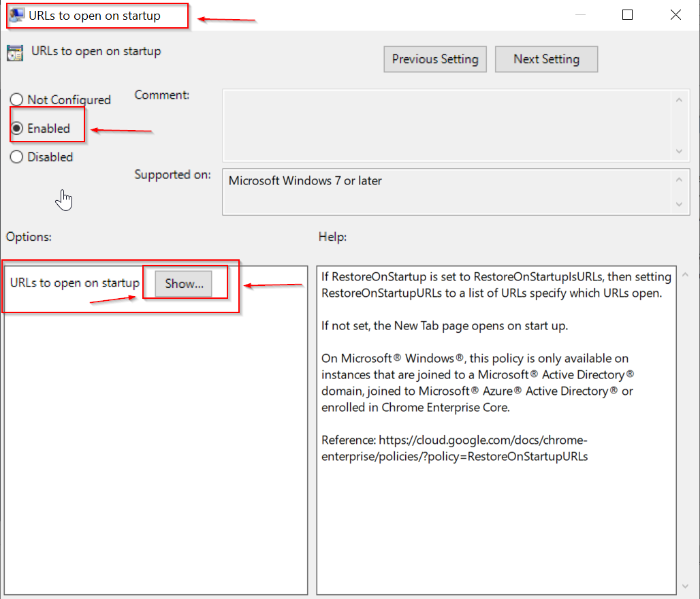

---

## 19. Hub and Spoke Topology in Azure

The hub-and-spoke model is a common Azure network architecture where a central **hub VNet** connects to multiple **spoke VNets** via peering.

**Benefits:**
- Centralised security and monitoring
- Shared services (DNS, firewall, VPN gateway) in the hub
- Isolated workloads in each spoke
- Cost-efficient — spokes don't need their own gateways

### Lab Architecture

```
[On-Prem DC] ←VPN→ [Hub VNet]
                         │
              ┌──────────┴──────────┐
              │                     │
         [Spoke VNet 1]       [Spoke VNet 2]
         (workloads)          (workloads)
```

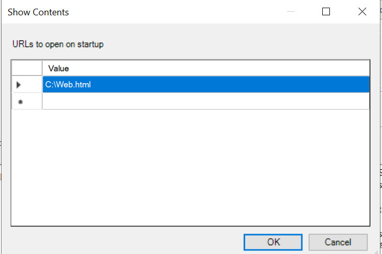

---

## 20. Firewall Deployment

Azure Firewall is a managed, cloud-based network security service that protects Azure Virtual Network resources.

### Steps to Deploy Azure Firewall

1. In the Azure Portal, search for **Firewalls** and click **Create**.
2. Select your **Resource Group**, **Region**, and **VNet**.
3. Create a new **AzureFirewallSubnet** (must be at least `/26`).
4. Assign a **Public IP** to the firewall.
5. Review and create.

### Lab Result

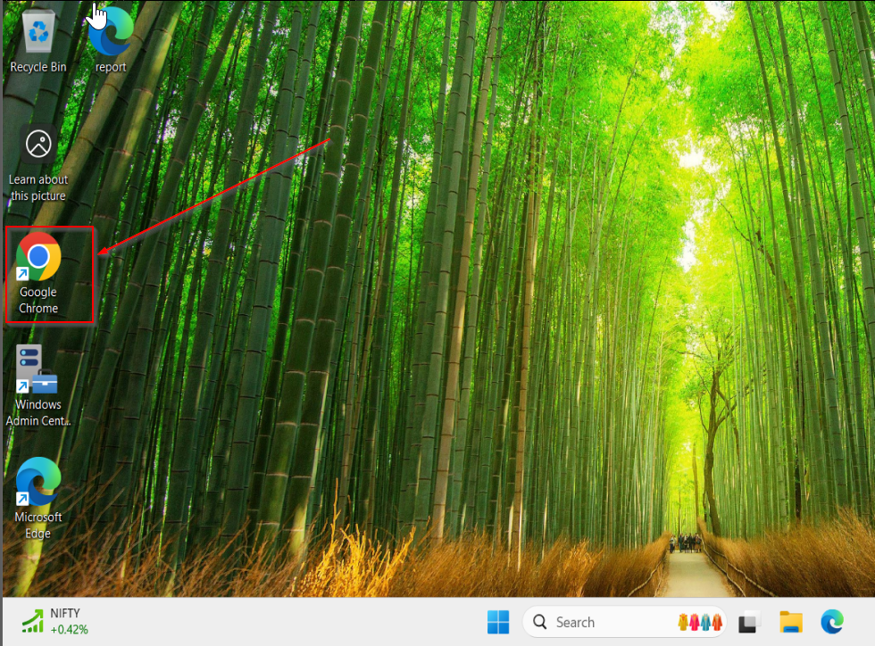

---

## 21. Spoke VM Deployment

Deploy VMs in spoke VNets to test routing and connectivity through the hub firewall.

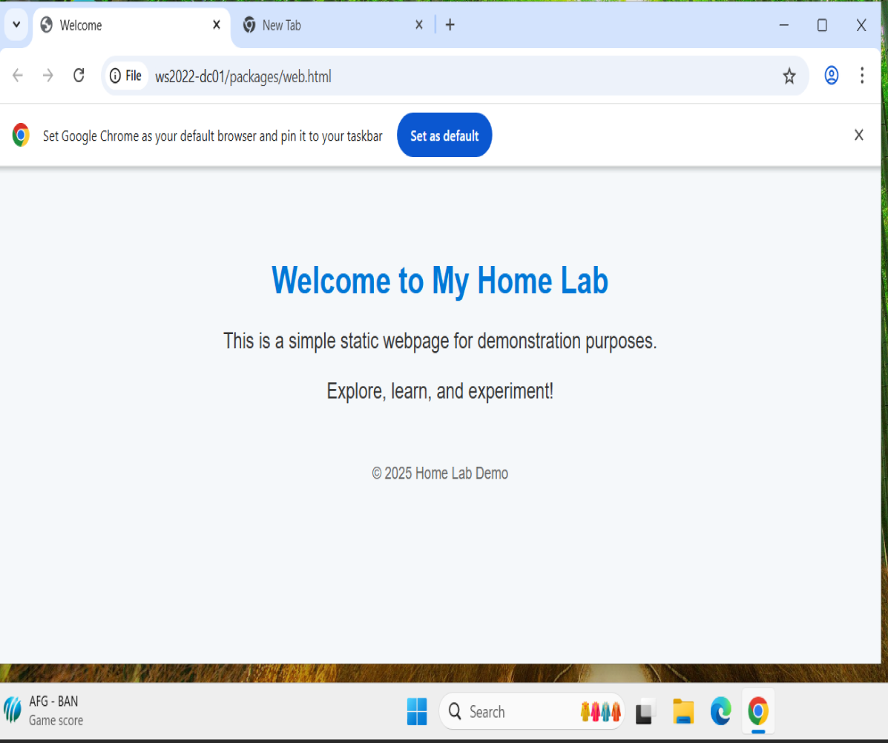

---

## 22. VNet Peering between DC VNet and Firewall VNet

VNet peering connects two Azure VNets so resources in each can communicate using private IP addresses.

### Steps

1. Go to the **DC VNet** → **Peerings** → **+ Add**.
2. Set the remote VNet to the **Firewall/Hub VNet**.
3. Enable **Allow gateway transit** on the hub side.
4. Enable **Use remote gateways** on the spoke side if routing through the hub gateway.
5. Repeat from the hub VNet back to the DC VNet.

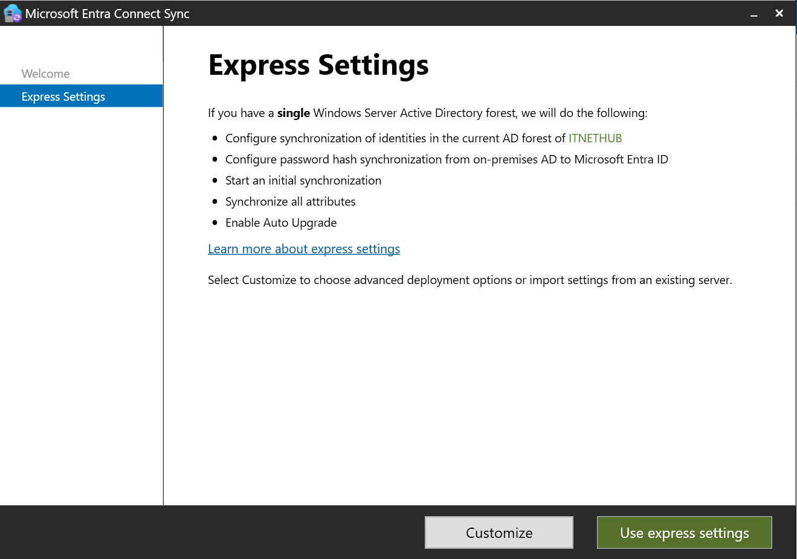

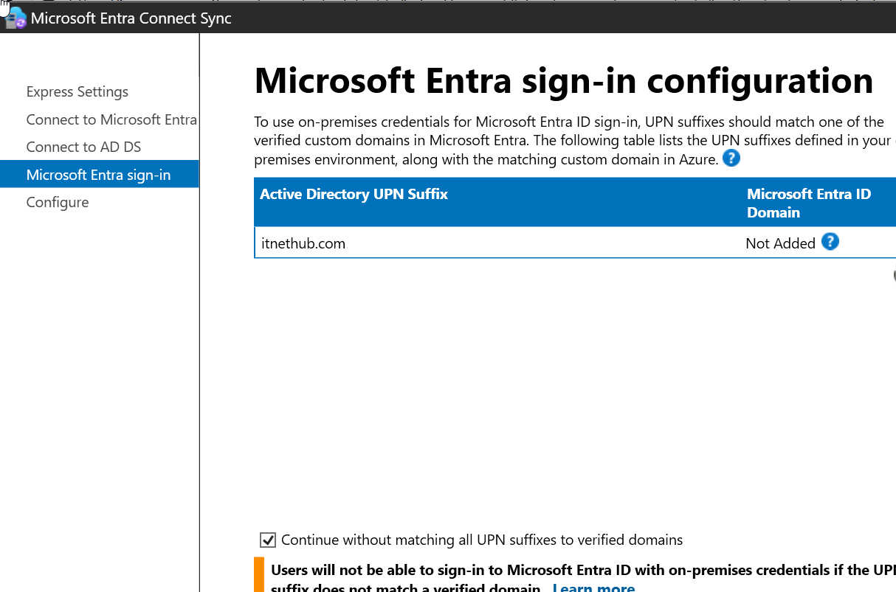

---

## 23. Troubleshooting

### Common Issues and Fixes

| Issue | Likely Cause | Fix |
|---|---|---|
| Images not loading in docs | Wrong file extension in markdown | Verify actual file extension in `/images` folder and update references |
| VPN tunnel not establishing | Phase 1/2 mismatch | Match IKE version, encryption, and hash on both pfSense and Azure |
| Domain join fails | DNS not resolving domain | Set VNet DNS to on-prem DC IP; verify pfSense firewall allows port 53 |
| Sync not reflecting in Entra ID | Delta sync not triggered | Run `Start-ADSyncSyncCycle -PolicyType Delta` manually |
| GPO not applying | GPO linked to wrong OU or not enforced | Run `gpresult /r` on client; check GPO scope and WMI filters |
| Chrome not deploying via GPO | MSI not accessible | Ensure share permissions allow SYSTEM account read access |

### Useful Commands

```powershell
# Force Group Policy refresh
gpupdate /force

# Check GPO application
gpresult /r

# Test AD connectivity
nltest /dsgetdc:itnethub.com

# Verify Entra Connect sync status
Get-ADSyncScheduler

# Force delta sync
Start-ADSyncSyncCycle -PolicyType Delta

# Test DNS resolution
nslookup itnethub.com 192.168.126.30

# Test port connectivity
Test-NetConnection -ComputerName 192.168.126.30 -Port 389
```
